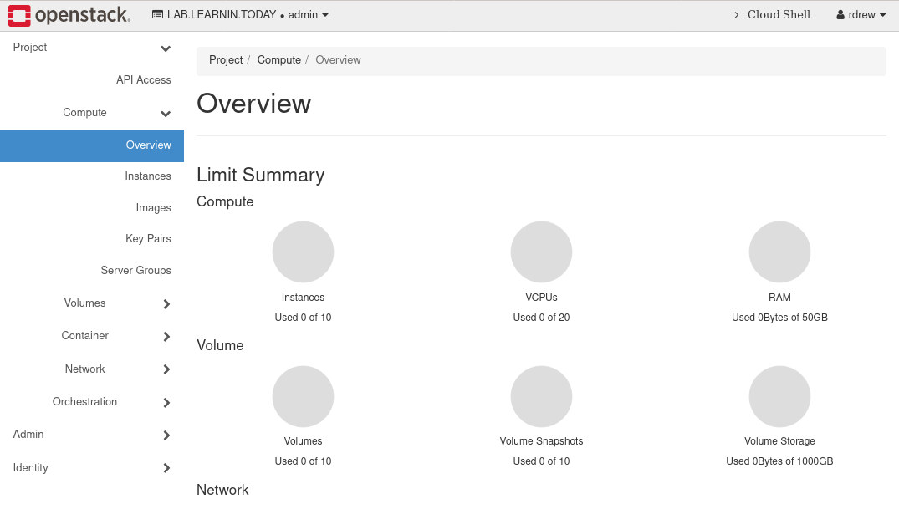
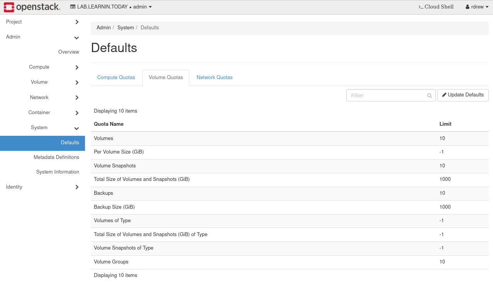

> Note that this article contains some content that I've censored, since I used my personal environment as an example.
>
> TL;DR: To give a user admin priviliges, you have to assign them the `admin` role and assign them to a project entitled `admin`.

Giving a domain user in OpenStack the role of domain operator/admin took me a second to figure out, so I thought I'd walk through my lessons learned here in a quick post.

For background, I just configured an LDAP-backed domain in Keystone and now need to give myself enough prvileges to operate my cloud. Based on the roles built into Keystone, which can be found [here](https://docs.openstack.org/keystone/ussuri/admin/identity-concepts.html), I needed to assign the `admin` role to my user. Let's start by listing out some key bits of information using our OpenStack CLI client. Since I deployed my cloud with [kolla-ansible](https://docs.openstack.org/kolla-ansible/latest/), I need to first initialize my python virtual environment and source the admin credentials:


```
(kolla-ansible)# python3 -m pipenv shell
(kolla-ansible)# . /etc/kolla/admin-openrc.sh
```

We'll list out our configured domains:

```
(kolla-ansible)# openstack domain list
+----------------------------------+-------------------+---------+--------------------+
| ID                               | Name              | Enabled | Description        |
+----------------------------------+-------------------+---------+--------------------+
| 1d6ac15b5b484c1685da00e5654ede3d | LAB.LEARNIN.TODAY | True    |                    |
| 4288dc2bce394cc6a8f273080846be60 | heat_user_domain  | True    |                    |
| default                          | Default           | True    | The default domain |
+----------------------------------+-------------------+---------+--------------------+
```

List of users in the LAB.LEARNIN.TODAY domain (there's my username, rdrew):

```
(kolla-ansible)# openstack user list --domain LAB.LEARNIN.TODAY
+------------------------------------------------------------------+-------+
| ID                                                               | Name  |
+------------------------------------------------------------------+-------+
| c2d31ab20cff8aece2e600fb7b1960bf7d74431468becad18b790b83076a7456 | rdrew |
+------------------------------------------------------------------+-------+
```

List of projects:

```
(kolla-ansible)# openstack project list
+----------------------------------+-----------+
| ID                               | Name      |
+----------------------------------+-----------+
| 1244f947d4e042a6936d32da924e497c | admin     |
| 903500018cf845b6b86d8109de518921 | service   |
+----------------------------------+-----------+
```

List of roles:

```
(kolla-ansible)# openstack role list
+----------------------------------+------------------+
| ID                               | Name             |
+----------------------------------+------------------+
| 01b0226fe26f4432ab10a8702af51655 | admin            |
| 17dab6fa07704cc4a01b1b0e09e21e7d | _member_         |
| 2b79ddd9a9ee4ceeba06a6340dd976d5 | heat_stack_owner |
| 7f77b7b1857a4ed19434bfb8be5ebbcf | reader           |
| aa0e713f90e640f88657bc1b9038a74b | member           |
| edcd1d22d2b9436a9849ab84cf5318c2 | heat_stack_user  |
+----------------------------------+------------------+
```

List of role assignments:

```
(kolla-ansible)# openstack role assignment list --names
+------------------+------------------------------------+------------------------------------+----------------------------+------------------+--------+-----------+
| Role             | User                               | Group                              | Project                    | Domain           | System | Inherited |
+------------------+------------------------------------+------------------------------------+----------------------------+------------------+--------+-----------+
| admin            | glance@Default                     |                                    | service@Default            |                  |        | False     |
| admin            | kuryr@Default                      |                                    | service@Default            |                  |        | False     |
| admin            | neutron@Default                    |                                    | service@Default            |                  |        | False     |
| admin            | admin@Default                      |                                    | admin@Default              |                  |        | False     |
| heat_stack_owner | admin@Default                      |                                    | admin@Default              |                  |        | False     |
| admin            | zun@Default                        |                                    | service@Default            |                  |        | False     |
| admin            | placement@Default                  |                                    | service@Default            |                  |        | False     |
| admin            | heat@Default                       |                                    | service@Default            |                  |        | False     |
| admin            | nova@Default                       |                                    | service@Default            |                  |        | False     |
| admin            | cinder@Default                     |                                    | service@Default            |                  |        | False     |
| admin            | heat_domain_admin@heat_user_domain |                                    |                            | heat_user_domain |        | False     |
| admin            | admin@Default                      |                                    |                            |                  | all    | False     |
+------------------+------------------------------------+------------------------------------+----------------------------+------------------+--------+-----------+
```

As you can tell, I haven't done much.

Let's do the obvious. I'm going to create a group in LDAP called `ops-operators`, assign it to my user, and then assign the `ops-operators` group the admin role for the `LAB.LEARNIN.TODAY` domain.

```
(kolla-ansible)# openstack group list --domain LAB.LEARNIN.TODAY --user rdrew --user-domain LAB.LEARNIN.TODAY
+------------------------------------------------------------------+-------------------+
| ID                                                               | Name              |
+------------------------------------------------------------------+-------------------+
...
| 7a948cd9768ca26ec01ad3352829c08df4c4c533ed8a330c169400280a1cfd48 | ops-operators     |
...
+------------------------------------------------------------------+-------------------+
(kolla-ansible)# openstack role add --group ops-operators --group-domain LAB.LEARNIN.TODAY --domain LAB.LEARNIN.TODAY admin
(kolla-ansible)# openstack role assignment list --names
+------------------+------------------------------------+------------------------------------+----------------------------+-------------------+--------+-----------+
| Role             | User                               | Group                              | Project                    | Domain            | System | Inherited |
+------------------+------------------------------------+------------------------------------+----------------------------+-------------------+--------+-----------+
...
| admin            |                                    | ops-operators@LAB.LEARNIN.TODAY    |                            | LAB.LEARNIN.TODAY |        | False     |
...
+------------------+------------------------------------+------------------------------------+----------------------------+-------------------+--------+-----------+
```

Now let's list effective privileges of my user:

```
(kolla-ansible)# openstack role assignment list --effective --user rdrew --user-domain LAB.LEARNIN.TODAY
+--------+-------------------------+-------+----------------------------+-------------------+--------+-----------+
| Role   | User                    | Group | Project                    | Domain            | System | Inherited |
+--------+-------------------------+-------+----------------------------+-------------------+--------+-----------+
| admin  | rdrew@LAB.LEARNIN.TODAY |       |                            | LAB.LEARNIN.TODAY |        | False     |
| member | rdrew@LAB.LEARNIN.TODAY |       |                            | LAB.LEARNIN.TODAY |        | False     |
| reader | rdrew@LAB.LEARNIN.TODAY |       |                            | LAB.LEARNIN.TODAY |        | False     |
+--------+-------------------------+-------+----------------------------+-------------------+--------+-----------+
(kolla-ansible)#
```

Awesome, but turns out we are still not done. Turns out that OpenStack is heavily project orientated and when resources in a project are managed through various API requests, there needs to be a 'source project' that those requests are delegated from ([source](https://docs.openstack.org/operations-guide/ops-users.html)). The `rdrew` user just can't make any requests at this point because there's no project assigned to the user. 

To see this in action, check out the role assignment listing again:

```
(kolla-ansible)# openstack role assignment list --names
+------------------+------------------------------------+------------------------------------+----------------------------+------------------+--------+-----------+
| Role             | User                               | Group                              | Project                    | Domain           | System | Inherited |
+------------------+------------------------------------+------------------------------------+----------------------------+------------------+--------+-----------+
...
| admin            | admin@Default                      |                                    | admin@Default              |                  |        | False     |
...
| admin            | admin@Default                      |                                    |                            |                  | all    | False     |
+------------------+------------------------------------+------------------------------------+----------------------------+------------------+--------+-----------+
```

The default `admin` user, who has the privileges we're looking for, is assigned the `admin` role in two places- both the `admin@Default` project and the System dealio.  We can emulate this with the following:

```
(kolla-ansible)# openstack project create admin --domain LAB.LEARNIN.TODAY
+-------------+----------------------------------+
| Field       | Value                            |
+-------------+----------------------------------+
| description |                                  |
| domain_id   | 1d6ac15b5b484c1685da00e5654ede3d |
| enabled     | True                             |
| id          | 12059a92980b4054bbb9b87358398b5e |
| is_domain   | False                            |
| name        | admin                            |
| options     | {}                               |
| parent_id   | 1d6ac15b5b484c1685da00e5654ede3d |
| tags        | []                               |
+-------------+----------------------------------+
(kolla-ansible)# openstack role add --project admin --project-domain LAB.LEARNIN.TODAY --group ops-operators --group-domain LAB.LEARNIN.TODAY admin
(kolla-ansible)# openstack role assignment list --effective --user rdrew --user-domain LAB.LEARNIN.TODAY --names
+--------+-------------------------+-------+----------------------------+-------------------+--------+-----------+
| Role   | User                    | Group | Project                    | Domain            | System | Inherited |
+--------+-------------------------+-------+----------------------------+-------------------+--------+-----------+
| admin  | rdrew@LAB.LEARNIN.TODAY |       | admin@LAB.LEARNIN.TODAY    |                   |        | False     |
| admin  | rdrew@LAB.LEARNIN.TODAY |       |                            | LAB.LEARNIN.TODAY |        | False     |
| member | rdrew@LAB.LEARNIN.TODAY |       |                            | LAB.LEARNIN.TODAY |        | False     |
| reader | rdrew@LAB.LEARNIN.TODAY |       |                            | LAB.LEARNIN.TODAY |        | False     |
| member | rdrew@LAB.LEARNIN.TODAY |       | admin@LAB.LEARNIN.TODAY    |                   |        | False     |
| reader | rdrew@LAB.LEARNIN.TODAY |       | admin@LAB.LEARNIN.TODAY    |                   |        | False     |
+--------+-------------------------+-------+----------------------------+-------------------+--------+-----------+
```

This looks kind of the same as our admin user:

```
(kolla-ansible)# openstack role assignment list --effective --user admin --user-domain Default --names
+------------------+---------------+-------+---------------+--------+--------+-----------+
| Role             | User          | Group | Project       | Domain | System | Inherited |
+------------------+---------------+-------+---------------+--------+--------+-----------+
| admin            | admin@Default |       | admin@Default |        |        | False     |
| heat_stack_owner | admin@Default |       | admin@Default |        |        | False     |
| member           | admin@Default |       | admin@Default |        |        | False     |
| reader           | admin@Default |       | admin@Default |        |        | False     |
+------------------+---------------+-------+---------------+--------+--------+-----------+
```

For some reason any 'system' role assignment doesn't show up when we add the `--effective` argument to our `role assignment list ` call:

```
(kolla-ansible)# openstack role assignment list --user admin --user-domain Default --names
+------------------+---------------+-------+---------------+--------+--------+-----------+
| Role             | User          | Group | Project       | Domain | System | Inherited |
+------------------+---------------+-------+---------------+--------+--------+-----------+
| admin            | admin@Default |       | admin@Default |        |        | False     |
| heat_stack_owner | admin@Default |       | admin@Default |        |        | False     |
| admin            | admin@Default |       |               |        | all    | False     |
+------------------+---------------+-------+---------------+--------+--------+-----------+
```

I have no idea why- if you know why, please send me an email!

Anyways, now when we log into Horizon as the `rdrew` user we get a sweet 'Admin' tab that appears in our sidebar:



Let's check it out:



Hell yeah. Case closed.
