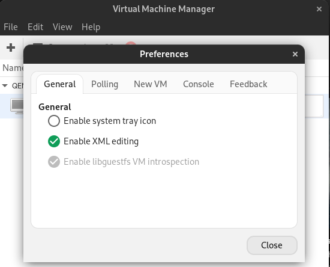
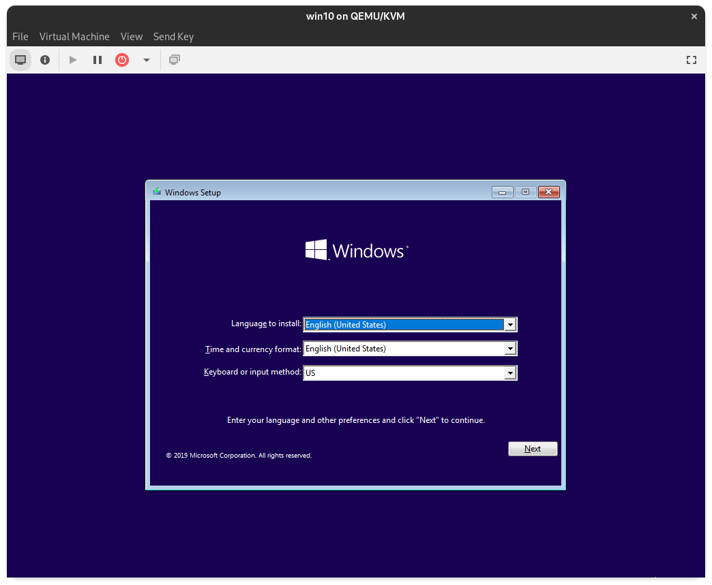

Last week I found myself in need for the recovery tools found on the [Windows 10 Installation ISO](https://www.microsoft.com/en-us/software-download/windows10ISO). I dual-boot Fedora Workstation and Windows 10 in order to have a nice balance between work and play, gaming in my spare time, however after upgrading my PC case I found that I coudn't boot into either of my OSes. What fun, especially considering my school semester started right around that time and Zoom is essential these days.

While working through this problem, (which turned out to be an issue with my EFI bootloader partitions), I discovered a neat little trick that made recovering my Windows 10 install a bit easier. It might be to of some use to other dual-booting folks or IT folks in general.

> For clarification, each OS in my workstation is installed on its own separate drive.

Normally when debugging an issue with Windows 10 not booting, one may choose to download the [Windows 10 Installation ISO](https://www.microsoft.com/en-us/software-download/windows10ISO), write it to a USB stick, boot the system up from the USB, and hit the button that says something like "Repair your PC". Windows has some great tools on there and there's lots of tutorials on utilizing these tools to fix common issues, such as [repairing the BCD](https://www.lifewire.com/how-to-rebuild-the-bcd-in-windows-2624508).

For whatever reason though, during my eight hour binge in trying to repair my system, I could not for the life of me get this ISO onto a USB and have it boot. Using my laptop (running OSX) I tried [Etcher](https://www.balena.io/etcher/), the [Universal USB Installer](https://www.pendrivelinux.com/universal-usb-installer-easy-as-1-2-3/), [UNetbootin](https://unetbootin.org/), [dd](https://www.2daygeek.com/linux-dd-command-create-a-bootable-usb-disk/), and this tutorial from [hackerbox.io](https://hackerbox.io/articles/bootable-usb-from-iso-using-osx/). In my lifetime I have only had success using Microsoft's [Windows Media Creation Tool](https://www.partitionwizard.com/clone-disk/windows-10-media-creation-tool.html) that only runs on Windows. I needed a workaround.

Luckily I had a backup of my Fedora Workstation home directory, so I decided to just forgoe recovering Windows for a second and instead reinstall Fedora from scratch. After I was booted into Fedora I had an idea to **create a virtual machine that would boot from the Win10 ISO and just pass my Windows disk through to it**, essentially performing the debugging process I wanted to do anyways but from one virtual layer up. This idea actually worked really well and was super convenient, as I never had to reboot and leave my Fedora OS in order to debug why my Windows install wasn't booting. Below I'll detail how one goes about creating this VM using KVM/QEMU.

## Creating the VM using KVM/QEMU

Creating this virtual machine required a bit of manual XML editing in order to get the proper disk passthrough of the Windows install. Here I'm going to be using [virt-manager](https://virt-manager.org/) rather than [virsh](https://www.libvirt.org/manpages/virsh.html) on the CLI, so first we need to go in and enable XML editing within the virt-manager GUI, as it is disabled by default. To do this, head to **Edit -> Preference -> General**.



Next we'll create the new VM, working through the setup wizard as follows:

* **Local install media (ISO image or CDROM)**. (Hit **Forward**)
* Set the [Win10 ISO](https://www.microsoft.com/en-us/software-download/windows10ISO) as the install media. (Hit **Forward**)
* Give the VM some memory and CPUS to work with. (Hit **Forward**)
* Deselect the **Enable storage for this virtual machine** option. (Hit **Forward**)
* Select **Customize configuration before install**. (Hit **Finish**)

> This next step is based on a tutorial from charleslabri.com that can be found [here](https://www.charleslabri.com/adding-passthrough-physical-disk-in-kvm-guests/)

The final step along this processes is to manually passthrough the target Windows disk to the VM. (My Fedora system labled my Windows install disk as `/dev/sdb`, but yours may be different!) To do this, in the new window that opened up after hitting **Finish**, hit **Add Hardware** in the lower left and selected **Storage** in the leftmost column. Go straight to the **XML** tab and enter the following XML, which will ask the host to pass the disk containing Windows (in this case `/dev/sdb`) to the VM using SATA:

```xml
<disk type='block' device='disk'>
  <driver name='qemu' type='raw'/>
  <source dev='/dev/sdb'/>
  <target dev='vdb' bus='sata'/>
</disk>
```

> Be sure to not add a trailing `/` onto your device path (i.e. `/dev/sdb` rather than `/dev/sdb/`). You may receive a permissions error of some sort if the extra `/` is added.

Now with this done, hit **Finish** and then **Begin Installation**. After a short period of time we should see the initial *Windows Setup* screen.



Hitting **Next** we get the glorious **Repair your computer** button. To verify that we have our Windows disk available to modify, select **Troubleshoot -> Command Prompt** and run some `diskpart`:


Viola! We can see the three standard partitions found on a disk with Windows installed! Now any of the tools found on this ISO will have access to the broken Windows disk we want to repair, yet there's no USB or rebooting required. If you have any questions or suggestions about this neat little tip, feel free to send me an email. My PGP key and address are posted on the left.

